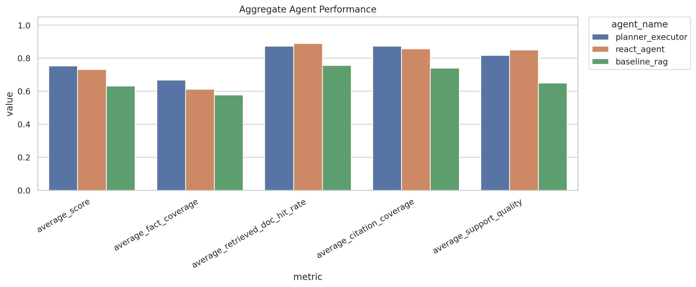
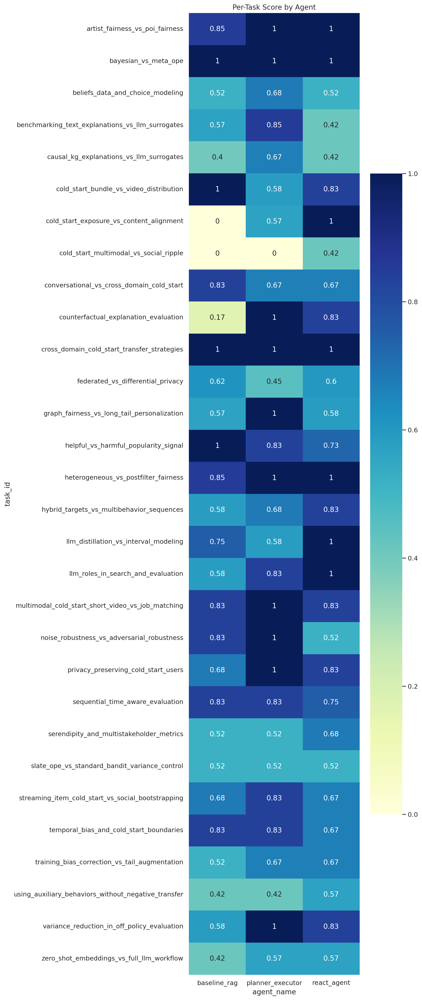
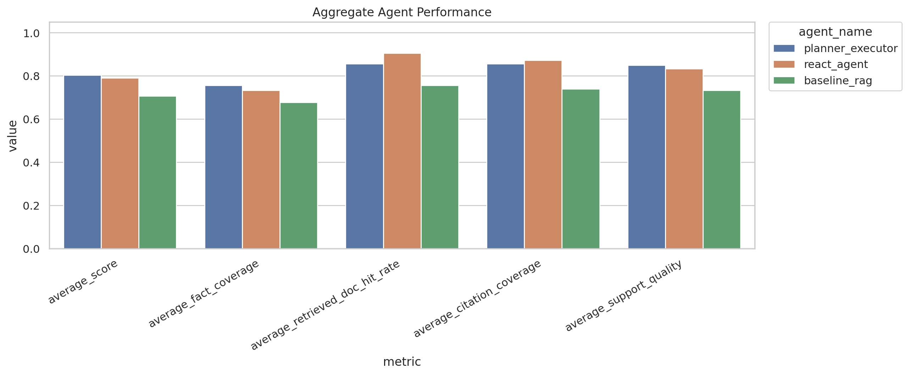
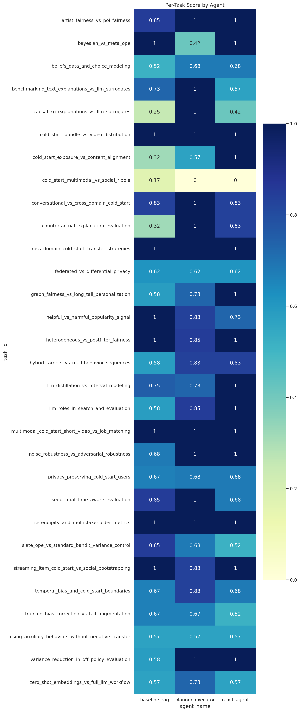
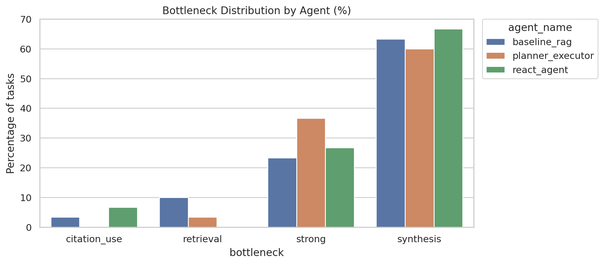
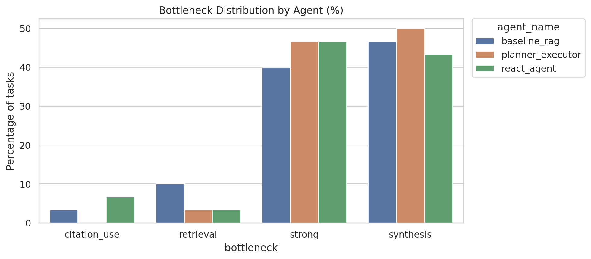

# Agentic Benchmark Harness

This project is a small benchmark harness for comparing tool-using research agents on a narrow domain.

The first domain is recommender systems. The goal is not just to build one agent. The goal is to build and run multiple agent designs on the same tasks, score them consistently, and inspect the tradeoffs.

## What This Project Does

Define:

- a task set
- a document corpus or tools the agents can use
- several agent variants
- an evaluator

Then the harness:

1. runs each agent on each task
2. records traces
3. scores the answers
4. writes comparable results

## Concrete Example

Example task:

> Find two common approaches for cold-start recommendation and explain one tradeoff between them.

The harness can compare:

- `BaselineRAGAgent`: retrieve once and answer
- `ReActAgent`: retrieve, inspect, decide whether to retrieve again, then answer
- `PlannerExecutorAgent`: plan subquestions first, then retrieve for each step, then synthesize

For each run, the harness stores:

- final answer
- citations
- retrieved documents
- agent steps
- metric scores

The corpus is stored as JSONL, one chunk per line. Each corpus row should include:

- `doc_id`
- `title`
- `source`
- `year`
- `url`
- `text`

A larger verified corpus can be generated with:

```bash
python scripts/build_recent_recsys_corpus.py
```

This writes `data/corpus/recsys_recent_2024_2025_300.jsonl` using DBLP table-of-contents records for RecSys, KDD, and WWW (2024-2025), plus OpenAlex abstracts for the `text` field.

## Project Layout

```text
.
├── configs
│   ├── default.yaml
│   ├── default_llm.yaml
│   └── large_llm.yaml
├── data
│   ├── corpus
│   │   ├── recsys_docs.jsonl
│   │   └── recsys_recent_2024_2025_300.jsonl
│   └── tasks
│       ├── recsys_recent_2024_2025_tasks.jsonl
│       └── sample_tasks.jsonl
├── notebooks
│   ├── analyze_benchmark_report.ipynb
│   └── plot_results
│       ├── large_llm_run0
│       │   ├── snapshot_1_summary_table.png
│       │   ├── snapshot_1_aggregate_agent_performance.png
│       │   ├── per_task_score_by_agent_heatmap.png
│       │   └── bottleneck_distribution_by_agent_pct.png
│       └── large_llm_run1
├── pyproject.toml
├── README.md
├── results
│   ├── benchmark_report.json
│   ├── benchmark_report_llm.json
│   ├── benchmark_report_large_llm.json
│   ├── run_manifest.json
│   ├── run_manifest_llm.json
│   └── run_manifest_large_llm.json
├── scripts
│   ├── build_recent_recsys_corpus.py
│   └── run_benchmark.py
└── src
    └── agentic_bench
        ├── agents
        │   ├── __init__.py
        │   ├── base.py
        │   ├── baseline.py
        │   ├── planner_executor.py
        │   └── react_agent.py
        ├── config.py
        ├── evaluator.py
        ├── llm_utils.py
        ├── runner.py
        ├── schemas.py
        ├── tasks.py
        └── tools.py
```

## Quick Start

Use Python 3.11+.

```bash
pip install -e .
PYTHONPATH=src python3 scripts/run_benchmark.py --config configs/default.yaml
```

The script writes:

- a benchmark report to `results/`
- a run manifest with the resolved config and git metadata

For the LLM-judged run:

```bash
PYTHONPATH=src python3 scripts/run_benchmark.py --config configs/default_llm.yaml
```

## Results Summary

Main benchmark setup:

- curated local corpus of 300 recent recommender-systems papers
- 30 research-style QA tasks
- 3 agents: `baseline_rag`, `react_agent`, `planner_executor`
- actor model: `gpt-4.1-mini`
- judge model: `gpt-5`
- evaluator: LLM-based

Two large LLM-judged runs are summarized below:

- `run0`: `results/run_manifest_large_llm.json` and `results/benchmark_report_large_llm.json`
- `run1`: `results/run_manifest_large_llm_1.json` and `results/benchmark_report_large_llm_1.json`

`run1` uses the same benchmark setup, but with improved answer-generation prompts for all agents and a tighter `ReAct` decision policy for when to stop searching and answer.

### Run 0

| Agent | Avg Score | Fact Coverage | Retrieved Gold Doc Hit Rate | Citation Coverage | Support Quality | Avg Steps |
| --- | ---: | ---: | ---: | ---: | ---: | ---: |
| `planner_executor` | 0.753 | 0.667 | 0.872 | 0.872 | 0.817 | 8.6 |
| `react_agent` | 0.732 | 0.611 | 0.889 | 0.856 | 0.850 | 6.4 |
| `baseline_rag` | 0.632 | 0.578 | 0.756 | 0.739 | 0.650 | 2.0 |



The hardest task in `run0` was `cold_start_multimodal_vs_social_ripple`:

> Compare SiBraR and SocRipple as solutions for new-item recommendation. What signal does each rely on first, and in what product setting would each be most natural?

Its mean score across agents was only `0.139`, which suggests that fine-grained cross-paper comparison remained difficult even with a curated local corpus.



### Run 1

| Agent | Avg Score | Fact Coverage | Retrieved Gold Doc Hit Rate | Citation Coverage | Support Quality | Avg Steps |
| --- | ---: | ---: | ---: | ---: | ---: | ---: |
| `planner_executor` | 0.804 | 0.756 | 0.856 | 0.856 | 0.850 | 8.6 |
| `react_agent` | 0.791 | 0.733 | 0.906 | 0.872 | 0.833 | 5.933 |
| `baseline_rag` | 0.707 | 0.678 | 0.756 | 0.739 | 0.733 | 2.0 |





### Run 0 vs Run 1

The changes in `run1` improved all three agents:

| Agent | Avg Score Run 0 | Avg Score Run 1 | Delta | Avg Steps Run 0 | Avg Steps Run 1 |
| --- | ---: | ---: | ---: | ---: | ---: |
| `baseline_rag` | 0.632 | 0.707 | +0.075 | 2.0 | 2.0 |
| `react_agent` | 0.732 | 0.791 | +0.059 | 6.4 | 5.933 |
| `planner_executor` | 0.753 | 0.804 | +0.051 | 8.6 | 8.6 |

The main pattern changed in an important way:

- `planner_executor` still has the best overall score, but only by a small margin.
- `react_agent` is now nearly tied on quality while using materially fewer steps than `planner_executor`.
- `baseline_rag` improved substantially, which suggests that the final answer prompt had been a real bottleneck even for the simple retrieve-once agent.

This makes the new practical conclusion stronger than in `run0`. The question is no longer simply which agent gets the top score. It is which agent gives the best quality-efficiency tradeoff.

On that front, `react_agent` now looks especially strong:

- it reaches `0.791` average score versus `0.804` for `planner_executor`
- it uses `5.933` steps on average versus `8.6` for `planner_executor`
- it still leads on retrieved gold document hit rate at `0.906`

That makes `react_agent` a very plausible default for a production-style system, even though `planner_executor` remains the top scorer.

The task family still helps explain why the planner remains competitive. Many benchmark questions ask the agent to compare multiple methods, extract contrasts, and synthesize tradeoffs. Those are naturally compatible with planner-executor because the decomposition is often knowable upfront. But `run1` shows that once answer synthesis and stopping rules are improved, the extra planning structure buys much less than it did in `run0`.





## Analysis Notebook

The notebook at `notebooks/analyze_benchmark_report.ipynb`:

- compares agents across aggregate metrics
- plots per-task score heatmaps
- analyzes bottleneck distributions
- generates an automatic narrative summary

It also exports report-ready artifacts to `notebooks/plot_results/` when run.
